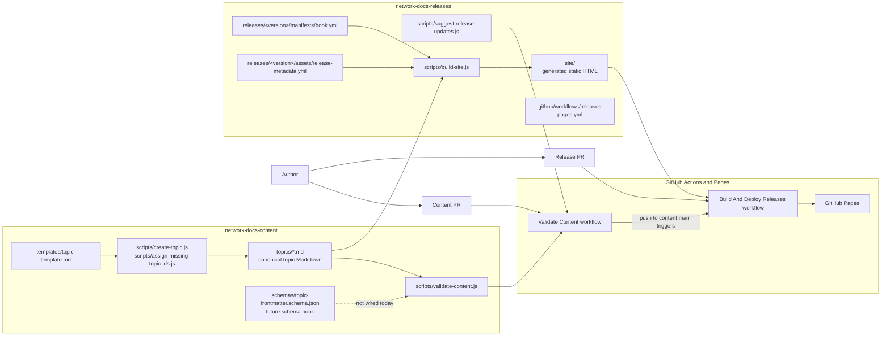
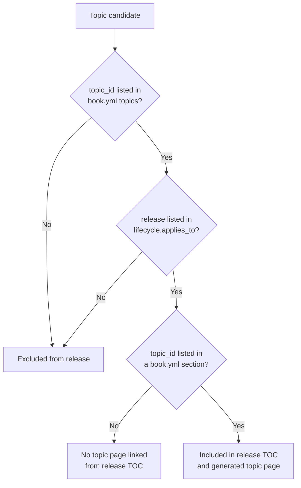
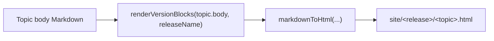
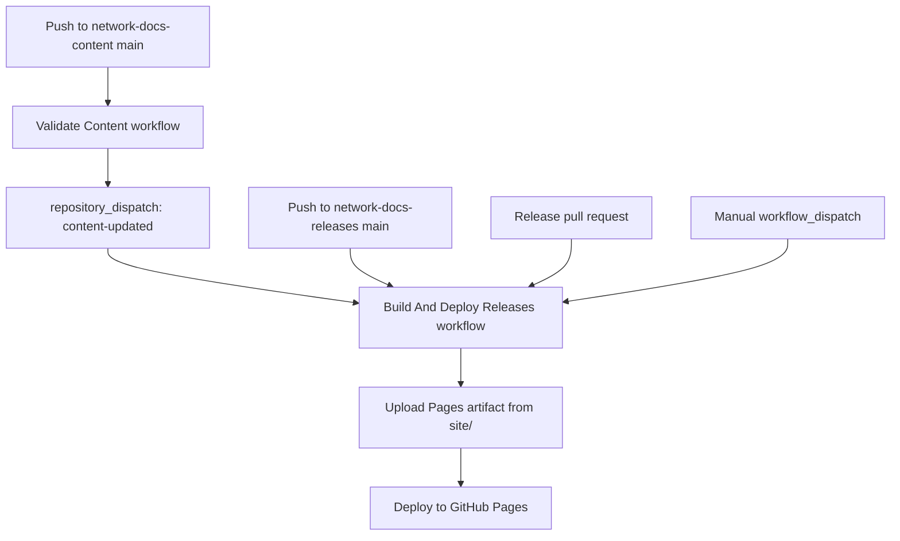

# Architecture

This solution separates canonical content from release packaging.

- `network-docs-content` owns reusable topic Markdown, frontmatter, schemas, templates, and content validation.
- `network-docs-releases` owns release manifests, release metadata, the static site builder, and the GitHub Pages deployment workflow.

## System Diagram



## Build Flow

```mermaid
sequenceDiagram
  participant GH as GitHub Actions
  participant Rel as network-docs-releases
  participant Con as network-docs-content
  participant Build as scripts/build-site.js
  participant Site as site/
  participant Pages as GitHub Pages

  GH->>Rel: checkout release repo
  GH->>Con: checkout content repo main
  GH->>Build: node build-site.js network-docs-content network-docs-releases
  Build->>Con: read topics/*.md
  Build->>Rel: read releases/&lt;version&gt;/manifests/book.yml
  Build->>Rel: read releases/&lt;version&gt;/assets/release-metadata.yml
  Build->>Build: filter topics by manifest and lifecycle.applies_to
  Build->>Build: render release-specific version blocks
  Build->>Site: write index.html and release topic pages
  GH->>Pages: deploy site/ artifact
```

## Topic Inclusion Rules

A topic appears in a release only when both conditions are true:

1. The topic `topic_id` is listed in `releases/<version>/manifests/book.yml`.
2. The topic frontmatter includes that release in `lifecycle.applies_to`.



## Version-Specific Content

Topics can contain release-specific blocks:

```md
:::version range="19.0"
Content for 19.0 only.
:::

:::version range="20.0+"
Content for 20.0 and later.
:::
```

`scripts/build-site.js` evaluates these blocks for each release before converting Markdown to HTML.



Supported range patterns:

- `19.0`: exact release match
- `20.0+`: release `20.0` and later
- `19.0-20.0`: inclusive release range

## Deployment Triggers



Pull requests run the release build but skip deployment. Pushes to `network-docs-releases/main`, manual dispatches, and content update dispatches can deploy to GitHub Pages.
